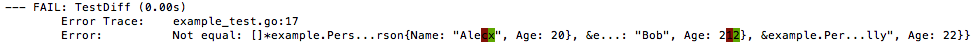

# Go assertion library (fork of [stretchr/testify/require](https://github.com/stretchr/testify/tree/master/require))

This is a fork of stretchr's assertion library that makes spotting differences in equality much
easier. It uses [repr](https://github.com/alecthomas/repr) and
[diffmatchpatch](https://github.com/sergi/go-diff/diffmatchpatch) to display structural differences
in colour.

## Example

Given the following test:

```go
type Person struct {
  Name string
  Age  int
}

func TestDiff(t *testing.T) {
  expected := []*Person{{"Alec", 20}, {"Bob", 21}, {"Sally", 22}}
  actual := []*Person{{"Alex", 20}, {"Bob", 22}, {"Sally", 22}}
  assert.Equal(t, expected, actual)
}
```

This is what testify/assert will display:

<pre>
--- FAIL: TestDiff (0.00s)
        Error Trace:    example_test.go:18
        Error:    Not equal: []*example.Person{(*example.Person)(0xc8200c27c0), (*example.Person)(0xc8200c27e0), (*example.Person)(0xc8200c2800)} (expected)
                          != []*example.Person{(*example.Person)(0xc8200c2840), (*example.Person)(0xc8200c2860), (*example.Person)(0xc8200c2880)} (actual)
</pre>

And this is what alecthomas/assert will display:


